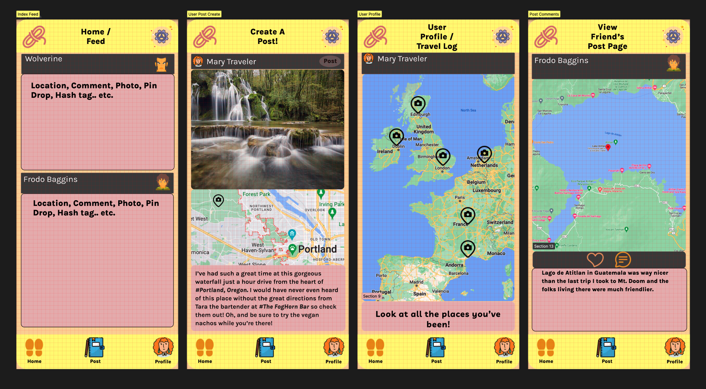

# ShoeString
### by Zach Sykes and Corey Loftus

## Introduction
Thanks for checking out ShoeString.

ShoeString is a digital guest book for Planet Earth -- an app where users can post about places they've physically traveled to, and share insider tips from their lived experiences there.

## Wireframe Images

## Getting Started
Fork and clone both repos here:
- [Frontend Repo](https://github.com/Calathea-Z/ShoeString)
- [Backend Repo](https://github.com/coreyloftus/shoestring-backend)

In your command line, install all dependencies using:
npm i

Load them up in your favorite code editor, and enjoy!